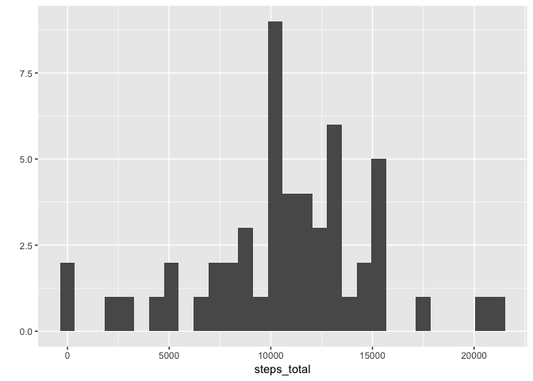
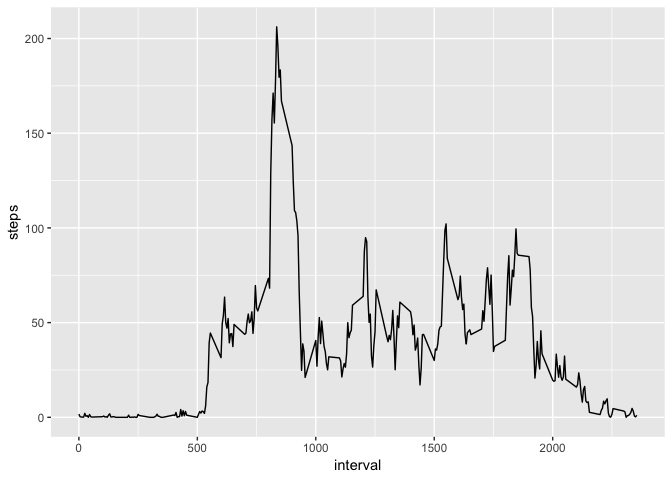
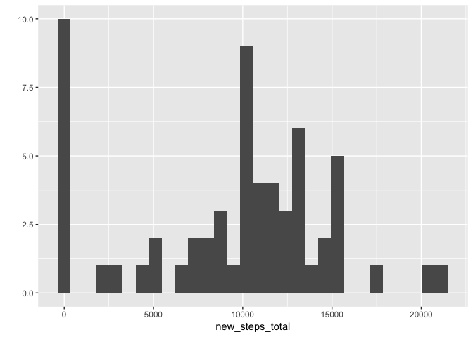
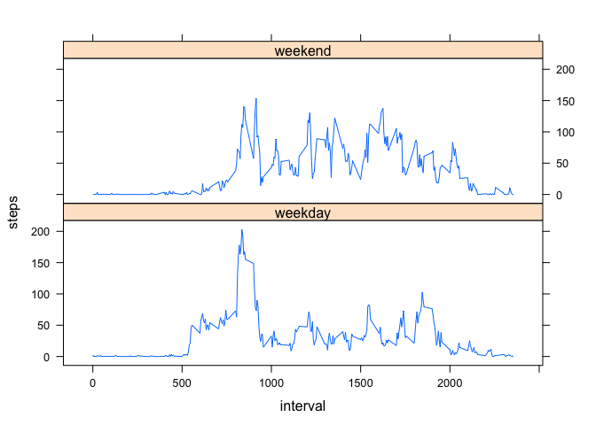

##Loading and preprocessing the data.

```r
data <- read.csv("activity.csv")
```

##What is mean total number of steps taken per day?
Below is a histogram of the total number of steps taken per day.

```r
steps_total <- tapply(data$steps, data$date, sum)
library(ggplot2)
qplot(steps_total)
```

```
## `stat_bin()` using `bins = 30`. Pick better value with `binwidth`.
```

```
## Warning: Removed 8 rows containing non-finite values (stat_bin).
```

<!-- -->

```r
meansteps_day <- round(mean(steps_total, na.rm=T))
mediansteps_day <- median(steps_total, na.rm=T)
```

The mean and the median of the total number of steps taken per day are 1.0766\times 10^{4} and 10765, respectively.

##What is the average daily activity pattern?
Below is the average daily activity pattern, i.e. a time series plot of the 5-minute interval (x-axis) and the average number of steps taken, averaged across all days (y-axis).

```r
avgdailypattern <- aggregate(steps ~ interval, data, mean, na.rm=T)
ggplot(avgdailypattern, aes(interval,steps)) + geom_line()
```

<!-- -->


The interval 835 contains the maximum number of steps.

## Imputing missing values
Missing values were replaced by the mean of each 5-minute interval.

```r
dailysteps_mean <- round(avgdailypattern[,2]/61)
dailysteps_mean_61 <- rep(dailysteps_mean, 61)
newdata <- data
for (i in 1:nrow(data)){
    if (is.na(data[i,1])){
        newdata[i,1] <- dailysteps_mean_61[i]
    }
}
```

The histogram of the total number of steps taken per day was created again after imputting missing values.

```r
new_steps_total <- tapply(newdata$steps, newdata$date, sum)
qplot(new_steps_total)
```

```
## `stat_bin()` using `bins = 30`. Pick better value with `binwidth`.
```

<!-- -->

```r
new_meansteps_day <- round(mean(new_steps_total, na.rm=T))
new_mediansteps_day <- median(new_steps_total, na.rm=T)
```
The new mean and the median of the total number of steps taken per day are 9378 and 1.0395\times 10^{4}, respectively. Before imputting missing values, the mean and median were 1.0766\times 10^{4} and 10765.

## Are there differences in activity patterns between weekdays and weekends?


```r
library(lubridate)
```

```
## 
## Attaching package: 'lubridate'
```

```
## The following object is masked from 'package:base':
## 
##     date
```

```r
newdata$date <- ymd(newdata$date)
weekdaynames <- c("Monday", "Tuesday", "Wednesday", "Thursday", "Friday")
newdata$weekday <- factor((weekdays(newdata$date) %in% weekdaynames), 
         levels=c(FALSE, TRUE), labels=c('weekend', 'weekday')) 

newdata_split <- split(newdata, newdata$weekday)
newavgdailypattern_weekday <- aggregate(steps ~ interval, newdata_split$weekday, mean, na.rm=T)
newavgdailypattern_weekday[,3] <- rep("weekday", nrow(newavgdailypattern_weekday))
names(newavgdailypattern_weekday)[3] <- "weekday"

newavgdailypattern_weekend <- aggregate(steps ~ interval, newdata_split$weekend, mean, na.rm=T)
newavgdailypattern_weekend[,3] <- rep("weekend", nrow(newavgdailypattern_weekend))
names(newavgdailypattern_weekend)[3] <- "weekday"

newavgdailypattern_merge <- rbind(newavgdailypattern_weekday, newavgdailypattern_weekend)

library(lattice)
xyplot(steps ~ interval | weekday, data=newavgdailypattern_merge, layout=c(1,2), type="l")
```

<!-- -->


